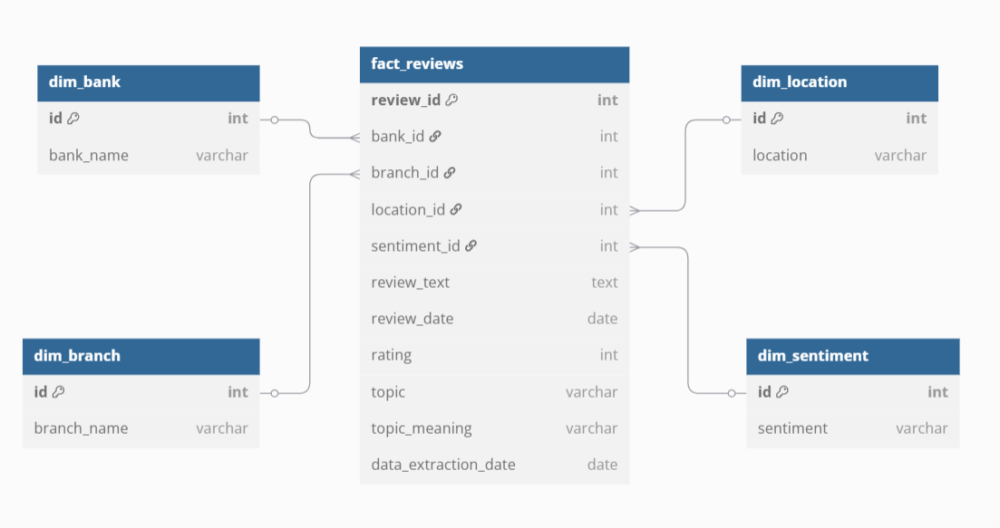
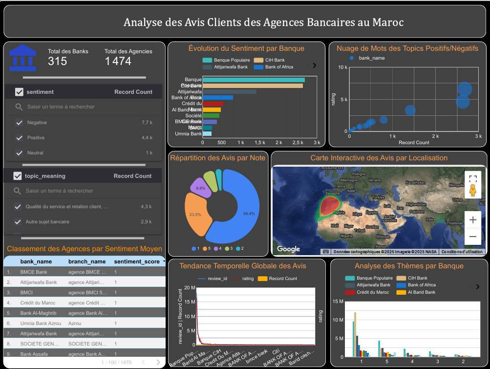

# 📦 Data Warehouse Project Submission

## 📌 Title
**Analyzing Customer Reviews of Bank Agencies in Morocco using a Modern Data Stack**

---

## 👨‍💻 Author

**Mohammed Dechraoui**  
Master 2 – Systèmes d'Information et Systèmes Intelligents (M2SI)  
Institut National de Statistique et d'Économie Appliquée (INSEA)  
📧 m.dechraoui@insea.ac.ma 
📅 Academic Year: 2024–2025  

---

## ✅ My Contributions

This project was developed individually as part of the Data Warehouse module. All components of the pipeline were implemented, tested, and documented by me.

### 🔹 Phase 1 – Data Collection
- Implemented a Python-based web scraper using **Scrapy** to extract:
  - Bank name
  - Branch location
  - Review text
  - Rating
  - Date of review
- Used **Google Maps search patterns** to locate bank branches in Morocco.
- Exported data to structured **JSON** and imported it into PostgreSQL.
- Designed and scheduled an **Apache Airflow DAG** to automate weekly extraction.

### 🔹 Phase 2 – Data Cleaning & Transformation
- Used **DBT (Data Build Tool)** to:
  - Clean raw review data (remove duplicates, missing values).
  - Normalize and preprocess text (lowercasing, stop words removal).
- Developed Python scripts to:
  - Detect the language of reviews.
  - Apply **sentiment analysis** using TextBlob.
  - Extract common themes using **LDA topic modeling**.
- Logged transformations and documented DBT models.

### 🔹 Phase 3 – Data Modeling (Star Schema)
- Designed and created the following tables in **PostgreSQL**:
  - `fact_reviews`
  - `dim_bank`
  - `dim_branch`
  - `dim_location`
  - `dim_sentiment`
- Used DBT to create SQL models and load data incrementally.
- Ensured referential integrity and optimized queries for BI tools.

### 🔹 Phase 4 – BI & Analytics
- Built a **Looker Studio (Data Studio)** dashboard:
  - Trends of customer sentiment per bank and branch.
  - Top positive/negative themes extracted from reviews.
  - Ranking of bank branches by average sentiment.
  - Interactive filters for location, bank, and date range.

### 🔹 Phase 5 – Deployment & Automation
- Integrated all steps in a single Apache Airflow workflow:
  - Daily DAG: fetch new reviews, update DBT models, refresh schema.
  - Included email alerts for DAG failures.

---

## 📁 Repository Structure

```
📁 project-data-warehouse/
├── airflow/
│   ├── dags/
│   │   └── dag_load_reviews.py
│   └── scripts/
│       ├── connect_to_db.py
│       ├── scraper_banks.py
│       ├── scraper.py
│       ├── insert_data_to_json.py
│       ├── insert_data_to_postgresql.py
│       ├── convertir_data_relative.py
│       ├── detect_language.py
│       ├── topic_modeling.py
│       ├── sentiment_analysis.py
│       ├── banks_maroc.json 
│       └── avis.json
│
├── .dbt/
│   └── dbt_projects/
│        ├── bank_reviews_decisionnal/
│        └── bank_reviews_transactional/
│
├── requirements.txt
│
└── README.md
```


---

## 📷 Project Visuals

### 📌 Architecture Diagram



> This diagram illustrates the complete pipeline from scraping to dashboarding, including Airflow, PostgreSQL, DBT, and Looker Studio.

### 📊 Dashboard (Looker Studio)



> Interactive dashboard presenting sentiment trends, top reviewed branches, frequent topics, and customer satisfaction distribution.

---

## 🛠️ Technologies & Dependencies

### 🔍 Web Scraping
- `selenium==4.19.0`
- `webdriver-manager==4.0.1`
- `beautifulsoup4==4.12.3`

### 🗂️ JSON & Utilities (built-in modules)
- `json`, `os`, `time`, `random`, `re`, `urllib.parse`, `logging`

### 🧠 NLP & Text Mining
- `langdetect==1.0.9`
- `transformers==4.41.1`
- `spacy==3.7.4`
- `nltk==3.8.1`
- `gensim==4.3.2`
- `pandas==2.2.2`

### 📦 Database
- `psycopg2-binary==2.9.9` (PostgreSQL connector)

### ⚙️ Workflow Orchestration
- **Apache Airflow** (DAG for ETL pipeline)

### 🧱 Data Modeling
- **DBT** (Data Build Tool – with two projects: transactional & decisionnal)

### 📊 Visualization
- **Looker Studio (Google Data Studio)** – Connected to PostgreSQL

---

## 📥 Required Downloads (before execution)

```bash
# spaCy language models
python -m spacy download en_core_web_sm
python -m spacy download fr_core_news_sm
python -m spacy download es_core_news_sm
python -m spacy download de_core_news_sm

# NLTK stopwords
python -c "import nltk; nltk.download('stopwords')"

```
---
## 🔄 Data Pipeline Flow

### 🏦 [Scraping]  
Banques et avis collectés via `scraper_banks.py` et `scraper.py`.

### 💾 [Storage]  
Données brutes stockées en JSON puis chargées dans PostgreSQL.

### 🧹 [Preprocessing]
- Conversion des dates relatives.
- Détection de la langue des avis.
- Analyse de sentiment avec modèles Transformers.
- Extraction des thèmes dominants avec modélisation LDA.

### 🤖 [Automation]  
Toutes les étapes sont orchestrées via le DAG Airflow : `dag_load_reviews.py`.

### 🧱 [Modeling]  
Données transformées avec DBT en tables de faits et de dimensions :
- `fact_reviews`
- `dim_bank`
- `dim_branch`
- `dim_location`
- `dim_sentiment`

### 📊 [Visualization]  
Tableaux de bord connectés à PostgreSQL via **Looker Studio**.

---

## 🔍 Example Use Cases

- Détection des agences sous-performantes à partir des avis clients.
- Identification des plaintes récurrentes (ex. : attente, panne DAB).
- Compréhension des différences régionales dans les avis.
- Benchmark des performances entre différentes banques.

---

## 🧠 Key Learning Outcomes

- Création de systèmes de scraping robustes et modulaires avec gestion d’erreurs.
- Application de techniques de NLP sur des données clients réelles.
- Construction de **schémas en étoile** et modélisation dimensionnelle.
- Utilisation d’**Airflow** et **DBT** pour des pipelines en production.
- Communication des résultats via des dashboards clairs et interactifs.

---

## 📄 Evaluation Checklist

| Deliverable                             | Status     |
|----------------------------------------|------------|
| ✅ Scraping scripts & data collection  | ✅ Complete |
| ✅ JSON → PostgreSQL loading           | ✅ Complete |
| ✅ NLP processing (lang/sentiment/topic) | ✅ Complete |
| ✅ DAG orchestration with Airflow      | ✅ Complete |
| ✅ Star schema & DBT models            | ✅ Complete |
| ✅ Dashboard Looker Studio             | ✅ Complete |
| ✅ Architecture + Documentation        | ✅ Complete |


## 📌 Remarks

This project simulates a real-world data engineering and analytics challenge in the banking sector, using customer voice data to drive insights.  
All scripts, models, dashboards, and datasets are included in this submission and stored in the GitHub repository.

